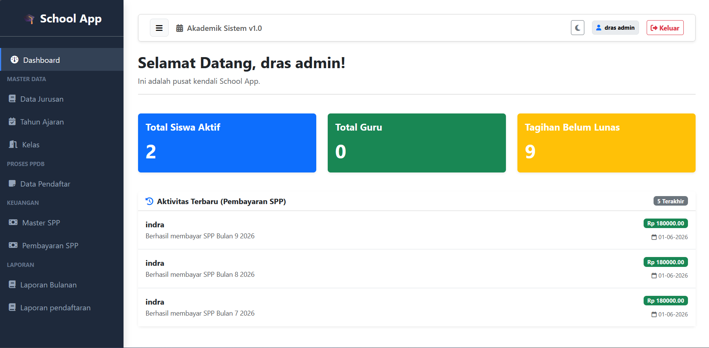
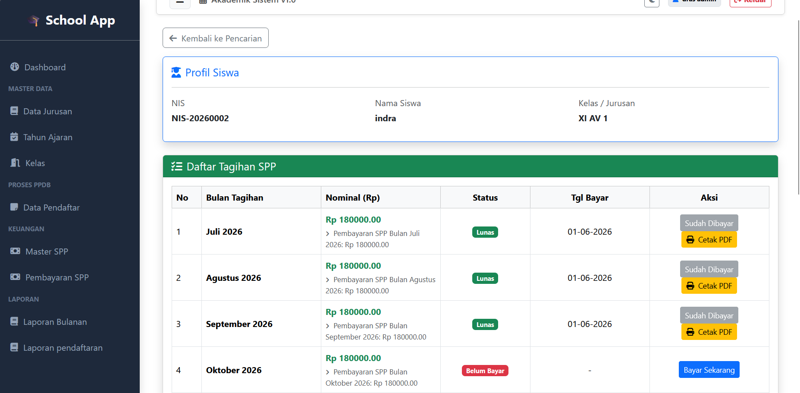
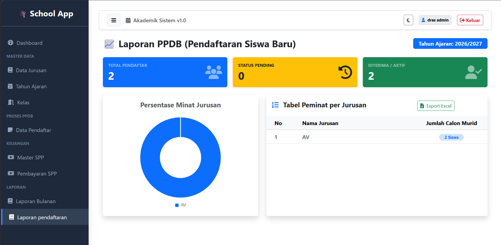
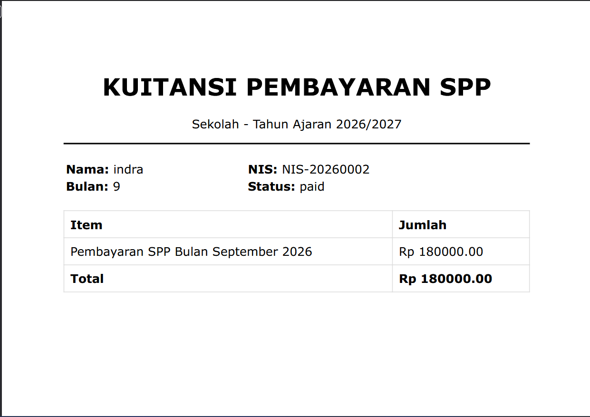
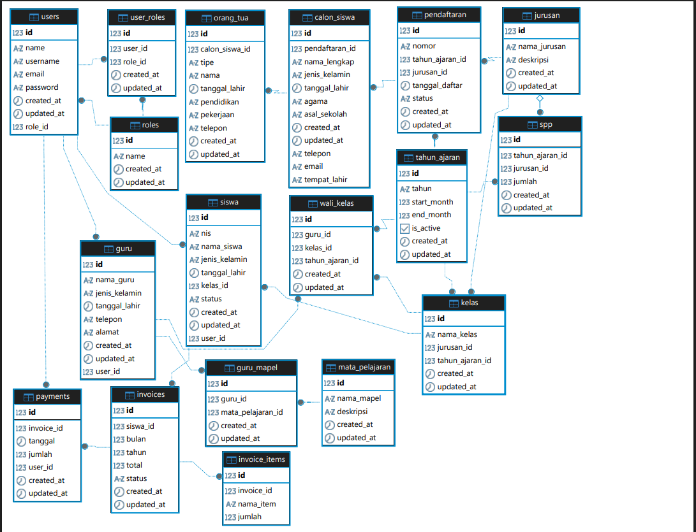

# School Academic & Financial Management System

[](https://www.python.org/)
[](https://flask.palletsprojects.com/)
[](https://htmx.org/)

Aplikasi web berbasis **Python Flask** untuk manajemen akademik, pendaftaran siswa baru (PPDB), dan kasir pengelolaan keuangan sekolah (Pembayaran SPP). Proyek ini dirancang khusus untuk memberikan pengalaman pengguna (UX) yang sangat responsif layaknya *Single Page Application* (SPA) dengan memanfaatkan teknologi **HTMX** guna mengoptimalkan performa server tanpa *reload* halaman.

---

## 📸 Preview Aplikasi

| Dashboard Utama & Grafik | Detail Kasir Pembayaran SPP |
|---|---|
|  |  |

| Laporan Grafik PPDB | Tampilan Cetak PDF Invoice |
|---|---|
|  |  |

| ERD Table                       |
|---------------------------------|
|  |

---

## 🚀 Fitur Utama

* **⚡ Fast Cashier & Live Search (HTMX):** Pencarian data siswa secara *live* dan eksekusi tombol "Bayar Sekarang" di kasir berjalan secara instan (*Real-Time Out-of-Band Swapping*) tanpa *refresh* halaman web.
* **📅 Automated Invoice Generator:** Begitu siswa dikonfirmasi aktif melalui modul PPDB, sistem *backend* secara otomatis men- *generate* 12 bulan tagihan SPP sekaligus mengikuti kalender akademik (Juli - Juni).
* **📊 Business Intelligence Dashboard (Chart.js):** Dilengkapi grafik batang (*Bar Chart*) untuk rekap pendapatan bulanan yayasan serta grafik donat (*Doughnut Chart*) untuk memetakan persentase minat jurusan calon siswa baru.
* **📄 Enterprise Reporting System (OpenPyXL & WeasyPrint):** * Fitur cetak kuitansi pembayaran/kuitansi fisik langsung berformat PDF secara *on-the-fly*.
  * Fitur *Export* data rekapitulasi keuangan bulanan dan pendaftaran ke format file Microsoft Excel (`.xlsx`).

---

## 🛠️ Tech Stack

* **Backend:** Python 3 (Flask Framework)
* **Database & ORM:** SQLAlchemy, PostgreSQL
* **Frontend:** Bootstrap 5, HTMX (*No-Reload*), Chart.js (Visualisasi Grafik)
* **Reporting Engines:** WeasyPrint (HTML to PDF compiler), OpenPyXL (Excel Generator)

---

## 🗄️ Arsitektur Database Utama

Aplikasi ini menggunakan relasi database *Relational* yang ketat guna menjaga integritas data keuangan sekolah:

| Nama Tabel | Fungsi Utama | Relasi Atribut |
| :--- | :--- | :--- |
| `siswa` | Menyimpan profil utama murid aktif | `1 to Many` ke tabel `invoice` |
| `invoice` | Mencatat record tagihan bulanan siswa | `Many to 1` ke `siswa`, `1 to Many` ke `payments` |
| `payments` | Menampung riwayat transaksi kasir | `Many to 1` ke tabel `invoice` & `user` |
| `pendaftaran` | Menyimpan data calon siswa baru (PPDB) | `Many to 1` ke tabel `jurusan` & `tahun_ajaran` |
| `user` & `role` | Mengatur hak akses otentikasi login pengguna | Relasi `Many to Many` lewat tabel `user_role` |

---

## 💻 Cara Menjalankan Proyek di Lokal

### 1. Clone Repository
```bash
git clone [https://github.com/indra210595/school-academic-finance-system.git](https://github.com/indra210595/school-academic-finance-system.git)
cd school-academic-finance-system

```
### 2. Buat & Aktifkan Virtual Environment
```bash
# Pengguna Windows:
python -m venv venv
venv\Scripts\activate

# Pengguna Linux / Mac:
python3 -m venv venv
source venv/bin/activate

```
### 3. Install Dependencies
```
pip install -r requirements.txt
```
### 4. Setup Environment Variables
Salin file .env.example menjadi .env, lalu lengkapi konfigurasinya:
```
# Di Windows (CMD/PyCharm Terminal):
copy .env.example .env

# Di Linux / Mac / Git Bash:
cp .env.example .env
```
### 5. Jalankan Aplikasi
```
flask run

```
Buka browser Anda dan akses halaman admin melalui URL: http://127.0.0.1:5000

## 📁 Struktur Direktori Proyek
```
flask-htmx-school-management/
│
├── app/
│   ├── __init__.py          # Inisialisasi Flask & DB
│   ├── models.py            # Skema Tabel Database (SQLAlchemy)
│   ├── akademik/            # Modul Logika Fitur PPDB & SPP
│   │   └── __init__.py
│   │   └── route_spp.py
│   │   └── route_jurusan.py
│   │   └── route_tahun_ajaran.py
│   │   └── route_kelas.py
│   │   └── route_pendaftaran.py
│   ├── auth/
│   │   └── route_auth.py    # Modul login
│   ├── main/
│   │   └── routes.py        # Modul dashboard
│   └── templates/           # File HTML (Jinja2)
│       ├── base.html
│       ├── dashboard.html
│       ├── auth/
│       │   └── login.html
│       ├── akademik/
│       │    ├── laporan_bulanan.html
│       │    └── detail_pembayaran_spp.html
│       └── main/
│           └── dashboard.html
│       
├── assets/                  # Penyimpanan Gambar & Screenshot README
├── .env.example             # Contoh format Environment Variables
├── .gitignore               # Daftar ignore file Git (venv, .env, db)
├── requirements.txt         # Daftar dependency library Python
└── run.py                   # Entry point utama aplikasi
```
Dibuat dengan ☕ dan 💻 oleh Indra Sadikin